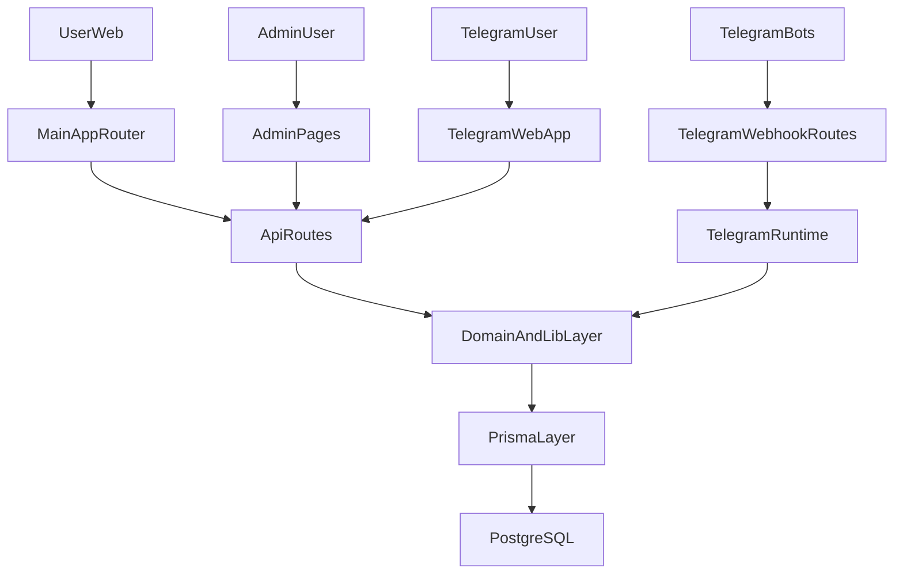

# Pack24 arxitektura ko'rinishi

## Umumiy tavsif

Pack24 bitta domen bilan cheklanmaydi. Repo quyidagi sirtlarni bitta tizimga
birlashtiradi:

- public qadoqlash mahsulotlari sayti
- admin boshqaruv paneli
- recycling operatsiyalari
- Telegram botlar
- Telegram Web App
- ombor va ishlab chiqarish modullari

## Asosiy kataloglar

### `src/app`

App Router qatlamidir.

- `src/app/(main)` — public sayt va admin sahifalar
- `src/app/(mobile)` — Telegram Web App uchun mobil layout
- `src/app/api` — server route'lar

### `src/lib`

Umumiy biznes va infra logika:

- `auth.ts`, `userAuth.ts`, `adminAuthShared.ts`
- `prisma.ts`
- `telegram/*`
- Zustand store va hook'lar
- domain helperlar

### `prisma/schema.prisma`

Yagona data model. Quyidagi yirik domenlarni qamrab oladi:

- user va auth
- product va order
- warehouse va stock movement
- work order va production
- recycle point, request, collection, complaint
- push, campaign, telegram config

## Muhim sirtlar

### 1. Public storefront

Asosiy customer journey:

- home
- catalog/category/product
- cart
- checkout
- payment
- order tracking

### 2. Admin panel

Admin panel bir nechta biznes blokni birlashtiradi:

- orders
- customers
- products
- marketing
- logistics
- production
- reports
- recycling

### 3. Recycling operatsiyalari

Recycling qatlami alohida mini-platforma darajasida:

- point boshqaruvi
- supervisor va driverlar
- request dispatch
- collection hisob-kitoblari
- complaint oqimi
- intake, press, expense, cash, sales jurnallari

### 4. Telegram qatlamlari

Uchta bot mavjud:

- customer bot
- driver bot
- admin bot

Har biri alohida runtime va webhook bilan ishlaydi.

## Arxitektura diagrammasi

## Texnik xavf nuqtalari

- `src/lib/telegram/adminBot.ts` juda katta va use-case'lar aralashgan
- `src/app/api/admin/reports/route.ts` ichida yirik agregatsiya logikasi bor
- `src/app/api/admin/recycling/journal/route.ts` da jamlash va formatlash bir joyda
- `prisma/schema.prisma` ichida ko'p string statuslar mavjud

## Tavsiya etilgan qatlamlash

Praktik yo'nalish quyidagicha:

1. route va bot handlerlar orchestration qatlami bo'lib qolsin
2. hisob-kitob va validatsiyalar `src/lib/domain/*` ichiga ajratilsin
3. status va transitionlar typed source-of-truth orqali boshqarilsin
4. schema qatlamiga migratsiya faqat kod qatlamlari tayyor bo'lgach kiritilsin
