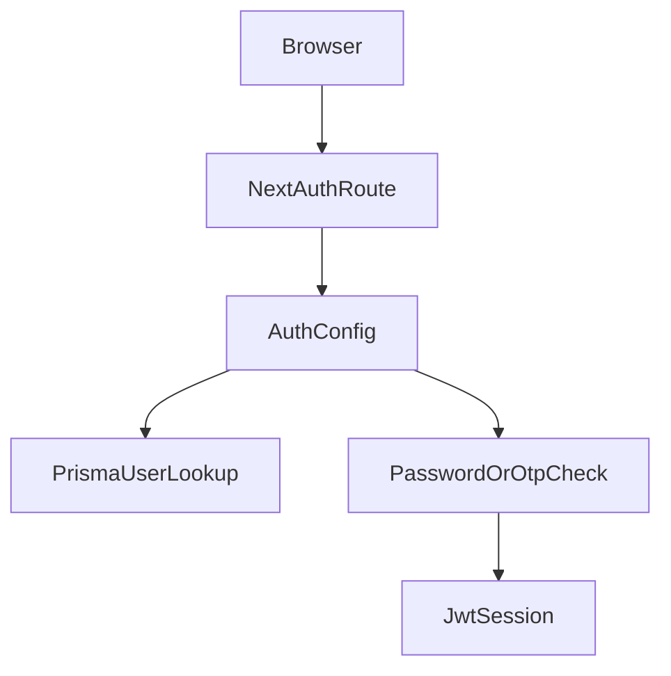
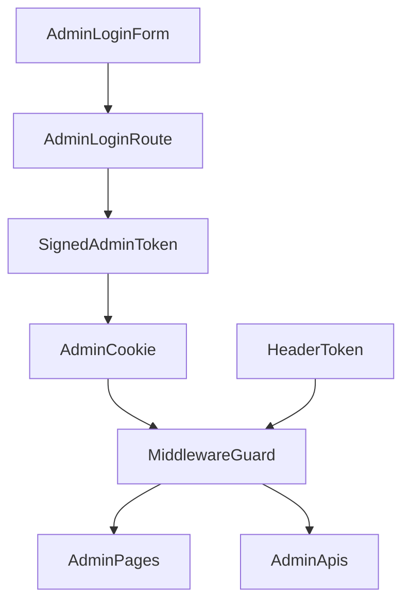
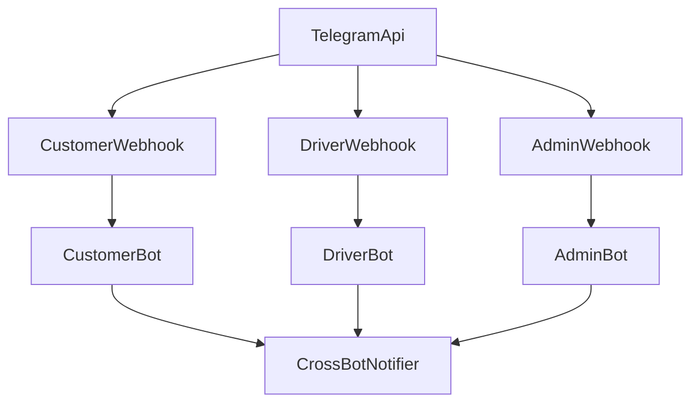

# Auth va runtime oqimlari

## 1. User auth

User login oqimi `NextAuth` orqali ishlaydi.

Asosiy fayllar:

- `src/lib/auth.ts`
- `src/app/api/auth/[...nextauth]/route.ts`
- `src/lib/userAuth.ts`

Qo'llab-quvvatlanadigan variantlar:

- telefon + parol
- telefon + Telegram OTP

### User auth diagrammasi

## 2. Admin auth

Admin auth user auth'dan alohida.

Asosiy fayllar:

- `src/app/api/admin/login/route.ts`
- `src/lib/adminAuthShared.ts`
- `src/middleware.ts`

Model:

- login route HMAC imzoli token yaratadi
- token `admin_auth` cookie sifatida saqlanadi
- API uchun `x-admin-token` header ham ishlatilishi mumkin
- middleware `/admin/*` va ayrim `/api/*` route'larni tekshiradi

### Admin auth diagrammasi

## 3. Telegram runtime

Telegram qatlamida uchta alohida bot mavjud:

- customer
- driver
- admin

Muhim fayllar:

- `src/lib/telegram/customerBot.ts`
- `src/lib/telegram/driverBot.ts`
- `src/lib/telegram/adminBot.ts`
- `src/app/api/telegram/webhook/route.ts`
- `src/app/api/telegram/webhook/driver/route.ts`
- `src/app/api/telegram/webhook/admin/route.ts`
- `src/app/api/telegram/start-polling/route.ts`

### Runtime xulqi

- Production yoki webhook rejimida Telegram `POST` update yuboradi
- Route `init*Bot()` ni chaqiradi
- Bot `handleUpdate()` orqali update'ni ishlaydi
- Dev rejimda `start-polling` route orqali polling ishga tushirilishi mumkin

### Telegram runtime diagrammasi

## 4. Route himoyasi matrix

| Sirt | Himoya usuli | Asosiy fayl |
|---|---|---|
| Public pages | Ochiq yoki page darajasida | `src/app/(main)` |
| User APIs | NextAuth session yoki route tekshiruvi | `src/lib/auth.ts` |
| Admin pages | middleware + admin cookie | `src/middleware.ts` |
| Admin APIs | middleware + cookie/header token | `src/middleware.ts` |
| Telegram webhook | Telegram source + bot token mavjudligi | `src/app/api/telegram/webhook/*` |

## 5. Muhim env qiymatlar

### User auth

- `AUTH_SECRET`

### Admin auth

- `ADMIN_USERNAME`
- `ADMIN_PASSWORD`
- `ADMIN_SECRET`

### Telegram

- `CUSTOMER_BOT_TOKEN`
- `DRIVER_BOT_TOKEN`
- `ADMIN_BOT_TOKEN`
- `TELEGRAM_BOT_TOKEN`
- `TELEGRAM_ADMIN_CHAT_ID`
- `NEXT_PUBLIC_APP_URL`

## 6. Amaliy qoidalar

Yangi route qo'shilganda quyidagi savollar berilishi kerak:

1. Bu route user session talab qiladimi?
2. Bu route admin token talab qiladimi?
3. Bu route webhook sifatida tashqi servisdan chaqiriladimi?
4. Bu route response'ida maxfiy admin ma'lumotlari bormi?

Agar route admin panel bilan bog'liq bo'lsa, default yondashuv:

- avval `middleware` matcher ichida himoyalanganini tekshirish
- keyin route ichida qo'shimcha role yoki input validatsiya yozish

## 7. Hozirgi xavf nuqtalari

- user auth va admin auth parallel bo'lgani uchun yangi route'larda noto'g'ri guard tanlanishi mumkin
- polling va webhook rejimlari aralash ishlatilganda bot lifecycle xatti-harakatlarini aniq nazorat qilish kerak
- Telegram bot init logikasi va notification oqimlari ko'p joyda biznes qoidaga ulanadi
